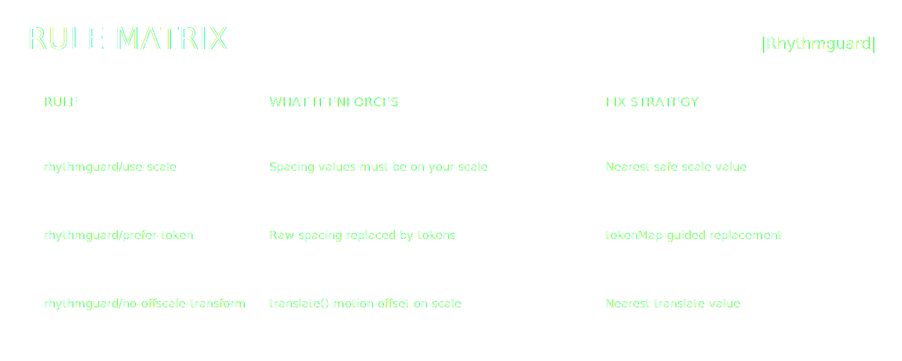

<p align="center">
  
</p>

# stylelint-plugin-rhythmguard

High-precision spacing governance for CSS and design systems.

[](https://github.com/petrilahdelma/stylelint-plugin-rhythmguard/actions/workflows/ci.yml)
[](https://www.npmjs.com/package/stylelint-plugin-rhythmguard)
[](https://www.npmjs.com/package/stylelint-plugin-rhythmguard)
[](./LICENSE)
[](https://nodejs.org/)

`stylelint-plugin-rhythmguard` enforces spacing discipline across margin, padding, gap, inset, scroll spacing, and translate motion offsets.

## 60-second Demo

- WebM: [rhythmguard-campaign-60s.webm](https://raw.githubusercontent.com/PetriLahdelma/stylelint-plugin-rhythmguard/main/assets/rhythmguard-campaign-60s.webm)

I built Rhythmguard after 20 years of watching teams ignore spacing scales and ship arbitrary pixel values everywhere.

It is built for teams that want:

- zero random spacing values in production CSS
- token-first spacing workflows
- predictable autofix behavior for large migrations
- consistent layout rhythm across web surfaces

## Rule Matrix

<p align="center">
  
</p>

| Rule | What it does | Autofix |
| --- | --- | --- |
| `rhythmguard/use-scale` | Enforces spacing values must be on your configured scale | Yes, nearest safe value |
| `rhythmguard/prefer-token` | Enforces token usage over raw spacing literals | Yes, with `tokenMap` |
| `rhythmguard/no-offscale-transform` | Enforces scale-aligned `translate*` motion offsets | Yes, nearest safe value |

## Installation

```bash
npm install --save-dev stylelint stylelint-plugin-rhythmguard
```

## Quick Start

### Recommended config

```json
{
  "extends": ["stylelint-plugin-rhythmguard/configs/recommended"]
}
```

### Strict config

```json
{
  "extends": ["stylelint-plugin-rhythmguard/configs/strict"]
}
```

`strict` intentionally delegates transform translation enforcement to `rhythmguard/no-offscale-transform` to reduce overlapping warnings from `use-scale`.

### Tailwind config

```json
{
  "extends": ["stylelint-plugin-rhythmguard/configs/tailwind"]
}
```

Stable shared config entry points:

- `stylelint-plugin-rhythmguard/configs/recommended`
- `stylelint-plugin-rhythmguard/configs/strict`
- `stylelint-plugin-rhythmguard/configs/tailwind`

### Full custom setup

```json
{
  "plugins": ["stylelint-plugin-rhythmguard"],
  "rules": {
    "rhythmguard/use-scale": [
      true,
      {
        "preset": "rhythmic-4",
        "units": ["px", "rem", "em"],
        "baseFontSize": 16,
        "tokenPattern": "^--space-",
        "tokenFunctions": ["var", "theme", "token"],
        "allowNegative": true,
        "allowPercentages": true,
        "fixToScale": true
      }
    ],
    "rhythmguard/prefer-token": [
      true,
      {
        "tokenPattern": "^--space-",
        "allowNumericScale": false,
        "tokenMap": {
          "4px": "var(--space-1)",
          "8px": "var(--space-2)",
          "12px": "var(--space-3)",
          "16px": "var(--space-4)"
        }
      }
    ],
    "rhythmguard/no-offscale-transform": [
      true,
      {
        "scale": [0, 4, 8, 12, 16, 24, 32]
      }
    ]
  }
}
```

### Presets and custom scales

Preset-based setup:

```json
{
  "rules": {
    "rhythmguard/use-scale": [true, { "preset": "fibonacci" }]
  }
}
```

Custom scale setup:

```json
{
  "rules": {
    "rhythmguard/use-scale": [true, { "customScale": [0, 6, 12, 18, 24, 36, 48] }]
  }
}
```

Scale resolution precedence:

1. `customScale` (highest priority)
2. `scale`
3. `preset`
4. default `rhythmic-4` scale

## Built-in Scale Presets

| Preset | Pattern | Scale |
| --- | --- | --- |
| `rhythmic-4` | 4pt rhythm | `[0,4,8,12,16,24,32,40,48,64]` |
| `rhythmic-8` | 8pt rhythm | `[0,8,16,24,32,40,48,64,80,96]` |
| `product-material-8dp` | Material 8dp baseline + 4dp increments | `[0,4,8,12,16,24,32,40,48,56,64,72,80]` |
| `product-atlassian-8px` | Atlassian-like product spacing progression | `[0,2,4,6,8,12,16,20,24,32,40,48,64,80]` |
| `product-carbon-2x` | Carbon 2x spacing progression | `[0,2,4,8,12,16,24,32,40,48,64,80]` |
| `editorial-baseline-4` | editorial baseline rhythm at 4-unit cadence | `[0,4,8,12,16,20,24,28,32,40,48,56,64]` |
| `editorial-baseline-6` | editorial baseline rhythm at 6-unit cadence | `[0,6,12,18,24,30,36,48,60,72]` |
| `compact` | dense UI spacing | `[0,2,4,6,8,12,16,20,24,32]` |
| `fibonacci` | Fibonacci progression | `[0,2,3,5,8,13,21,34,55,89]` |
| `powers-of-two` | geometric doubling | `[0,2,4,8,16,32,64,128]` |
| `golden-ratio` | ratio 1.618 | generated modular sequence |
| `modular-major-second` | ratio 1.125 | generated modular sequence |
| `modular-minor-third` | ratio 1.2 | generated modular sequence |
| `modular-major-third` | ratio 1.25 | generated modular sequence |
| `modular-augmented-fourth` | ratio 1.414 | generated modular sequence |
| `modular-perfect-fourth` | ratio 1.333 | generated modular sequence |
| `modular-perfect-fifth` | ratio 1.5 | generated modular sequence |

Aliases:

- `4pt` → `rhythmic-4`
- `8pt` → `rhythmic-8`
- `material` → `product-material-8dp`
- `atlassian-8` → `product-atlassian-8px`
- `carbon` → `product-carbon-2x`
- `baseline-4` → `editorial-baseline-4`
- `baseline-6` → `editorial-baseline-6`
- `golden` → `golden-ratio`
- `major-second` → `modular-major-second`
- `minor-third` → `modular-minor-third`
- `major-third` → `modular-major-third`
- `augmented-fourth` → `modular-augmented-fourth`
- `perfect-fourth` → `modular-perfect-fourth`
- `perfect-fifth` → `modular-perfect-fifth`

### Preset Rationale

- Product presets are based on widely-used design-system spacing frameworks.
- Editorial presets model baseline-grid cadence used in long-form typography and column layouts.
- Theory presets expose mathematically-derived modular scales from design theory and typographic proportion systems.
- Full research notes and sources are documented in [`docs/SCALE_RESEARCH.md`](https://github.com/PetriLahdelma/stylelint-plugin-rhythmguard/blob/main/docs/SCALE_RESEARCH.md).

## Community Scale Registry

Rhythmguard supports community-contributed scale presets from `scales/community/*.json`.

### Current community scales

| Preset | Base | Pattern | Contributor |
| --- | --- | --- | --- |
| `product-decimal-10` | `10` | Decimal-friendly dashboard/product cadence | [Petri Lahdelma](https://github.com/PetriLahdelma) |

### Contribute a scale

1. Scaffold a new scale file:

```bash
npm run scales:add -- --name my-team-scale --base 8 --steps 0,4,8,12,16,24,32
```

2. Validate:

```bash
npm run scales:validate
```

3. Open a PR with your scale JSON.

Full specification and policy: [`docs/COMMUNITY_SCALES.md`](https://github.com/PetriLahdelma/stylelint-plugin-rhythmguard/blob/main/docs/COMMUNITY_SCALES.md).

If your scale is private or very niche, keep it in your project config with `customScale` instead of contributing it to the shared registry.

## Rule Details

### `rhythmguard/use-scale`

Enforces spacing literals to stay on a configured numeric scale.

Checks:

- `margin*`, `padding*`
- `gap`, `row-gap`, `column-gap`
- `inset*`, `scroll-margin*`, `scroll-padding*`
- `translate`, `translate-x`, `translate-y`, `translate-z`
- `transform` translation functions (`translate`, `translateX`, `translateY`, `translateZ`, `translate3d`)

Example:

```css
/* ❌ Off-scale */
.card {
  margin: 13px;
  transform: translateY(18px);
}

/* ✅ On-scale */
.card {
  margin: 12px;
  transform: translateY(16px);
}
```

Options:

| Option | Type | Default | Description |
| --- | --- | --- | --- |
| `preset` | `string` | `rhythmic-4` | Selects a built-in spacing scale |
| `customScale` | `Array<number|string>` | `undefined` | Highest-priority custom scale override |
| `scale` | `Array<number|string>` | `[0,4,8,12,16,24,32,40,48,64]` | Allowed spacing values |
| `units` | `string[]` | `['px','rem','em']` | Units considered for scale enforcement |
| `baseFontSize` | `number` | `16` | Used for `rem`/`em` conversion |
| `tokenPattern` | `string` | `^--space-` | Regex for accepted token variable names |
| `tokenFunctions` | `string[]` | `['var','theme','token']` | Functions treated as tokenized values |
| `allowNegative` | `boolean` | `true` | Allows negative scale values |
| `allowPercentages` | `boolean` | `true` | Allows `%` values without scale checks |
| `fixToScale` | `boolean` | `true` | Enables nearest-value autofix |
| `enforceInsideMathFunctions` | `boolean` | `false` | Lints `calc()/clamp()/min()/max()` internals |
| `properties` | `Array<string|RegExp>` | built-in spacing patterns | Override targeted property set |

### `rhythmguard/prefer-token`

Enforces token usage for spacing declarations. This is ideal once your token system is stable.

Example:

```css
/* ❌ Raw literals */
.stack {
  gap: 12px;
  padding: 16px;
}

/* ✅ Tokenized */
.stack {
  gap: var(--space-3);
  padding: var(--space-4);
}
```

Options:

| Option | Type | Default | Description |
| --- | --- | --- | --- |
| `tokenPattern` | `string` | `^--space-` | Regex for accepted token variable names |
| `tokenFunctions` | `string[]` | `['var','theme','token']` | Functions treated as tokenized values |
| `allowNumericScale` | `boolean` | `false` | Temporary migration mode to permit on-scale literals |
| `preset` | `string` | `rhythmic-4` | Selects a built-in scale used in migration mode |
| `customScale` | `Array<number|string>` | `undefined` | Highest-priority custom scale override |
| `scale` | `Array<number|string>` | `[0,4,8,12,16,24,32,40,48,64]` | Used when `allowNumericScale` is enabled |
| `baseFontSize` | `number` | `16` | Used for scale checks with `rem`/`em` |
| `enforceInsideMathFunctions` | `boolean` | `false` | Lints `calc()/clamp()/min()/max()` internals |
| `tokenMap` | `Record<string,string>` | `{}` | Enables autofix from raw value to token |
| `ignoreValues` | `string[]` | CSS global keywords + `auto` | Skips keyword literals |
| `properties` | `Array<string|RegExp>` | built-in spacing patterns | Override targeted property set |

### `rhythmguard/no-offscale-transform`

Specialized guardrail for motion spacing consistency in translation transforms.

Example:

```css
/* ❌ Off-scale motion */
.toast {
  transform: translateY(18px) scale(1);
}

/* ✅ Motion on spacing scale */
.toast {
  transform: translateY(16px) scale(1);
}
```

Options:

`rhythmguard/no-offscale-transform` accepts the same scale options as `rhythmguard/use-scale`, but only for transform translation properties.

## Tailwind CSS Integration

Rhythmguard works well in Tailwind projects, but it enforces what Stylelint can parse: CSS declarations.

### What Rhythmguard covers in Tailwind projects

- custom CSS in `globals.css`, `components.css`, `utilities.css`
- CSS Modules (for example `*.module.css`)
- declarations inside `@layer` blocks

### What Rhythmguard does not cover

- Tailwind class strings in templates/JSX/TSX, for example:
  - `class="p-4 gap-2"`
  - `class="p-[13px] translate-y-[18px]"`

Those are not Stylelint declaration nodes, so they are outside this plugin's scope.

### Recommended stack for full Tailwind enforcement

Use both layers:

1. Stylelint + Rhythmguard for CSS declaration governance.
2. Tailwind-aware class-string linting/formatting for template utility usage.

Suggested setup:

```json
{
  "extends": ["stylelint-plugin-rhythmguard/configs/tailwind"]
}
```

Then pair with:

- `eslint-plugin-tailwindcss` for class-string rules (including arbitrary-value governance).
- `prettier-plugin-tailwindcss` for deterministic class ordering.

Detailed setup reference: [`docs/TAILWIND.md`](https://github.com/PetriLahdelma/stylelint-plugin-rhythmguard/blob/main/docs/TAILWIND.md).

### Tailwind token function support

By default, `tokenFunctions` includes `theme`, so values like `theme(spacing.4)` are treated as tokenized values.

### Product direction

We should extend Tailwind coverage thoroughly, but in the right architecture:

- keep `stylelint-plugin-rhythmguard` focused on CSS declaration enforcement
- add a complementary Tailwind class-string layer (ESLint/plugin side) for utility classes

This avoids brittle parsing hacks and gives full coverage without compromising rule quality.

## Programmatic Presets

```js
const rhythmguard = require('stylelint-plugin-rhythmguard');

console.log(rhythmguard.presets.listScalePresetNames());
console.log(rhythmguard.presets.listCommunityScalePresetNames());
console.log(rhythmguard.presets.getCommunityScaleMetadata('product-decimal-10'));
console.log(rhythmguard.presets.scales['rhythmic-4']);
```

## Autofix Philosophy

Rhythmguard only applies deterministic fixes:

- nearest scale value for numeric off-scale literals
- explicit `tokenMap` replacements for token migration

It will not guess token mappings without your map.

## Compatibility

- Stylelint: `^16.0.0`
- Node.js: `>=18.18.0`
- Module format: CommonJS plugin package
- Note: Stylelint `16.0.0` has known autofix/API behavior differences; CI enforces floor compatibility and runs non-blocking full-suite observability on the floor version.

## Development

```bash
npm install
npm run lint
npm test
npm run test:coverage
```

## Performance Benchmarking

Compare runtime against `stylelint-scales` on a deterministic spacing corpus:

```bash
npm run bench:perf
```

Benchmark with autofix enabled:

```bash
npm run bench:perf:fix
```

Detailed methodology and custom args are documented in [`docs/BENCHMARKING.md`](https://github.com/PetriLahdelma/stylelint-plugin-rhythmguard/blob/main/docs/BENCHMARKING.md).

## Article

- Dev.to: [Enforcing your spacing standards with Rhythmguard](https://dev.to/petrilahdelma/enforcing-your-spacing-standards-with-rhythmguard-a-custom-stylelint-plugin-1ojj)

## Release Workflow

1. Create a GitHub release.
2. `release.yml` runs the Node/Stylelint matrix validation.
3. A tarball smoke test validates package exports and install behavior.
4. If `NPM_TOKEN` is configured in repository secrets, the package is published to npm with provenance (`npm publish --provenance`).
5. If `NPM_TOKEN` is not configured, publish is skipped with an explicit workflow notice.
6. `post-publish-smoke.yml` verifies the published npm version can be installed and run in a clean project (and skips cleanly if the version is not on npm).

## Support and Bug Reports

- Open an issue: <https://github.com/petrilahdelma/stylelint-plugin-rhythmguard/issues>
- Security reports and direct contact: `hello@petrilahdelma.com`

## License

MIT. See [`LICENSE`](./LICENSE).
